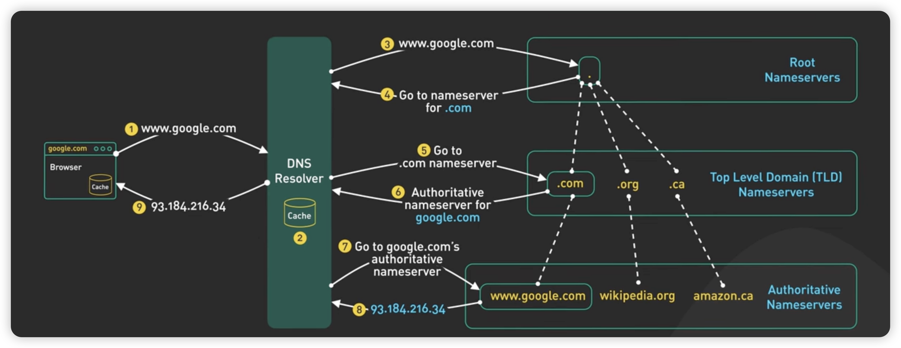

# interview

# Weekly Report of Graduation Design

- Introduction
    - Purpose of weekly report
    - Overview of graduation design project
- Progress made this week
    - List of tasks completed
    - Explanation of challenges encountered
- Goals for next week
    - List of tasks to be completed
    - Anticipated challenges and how to overcome them
- Conclusion
    - Summary of progress made so far
    - Reflection on overall experience